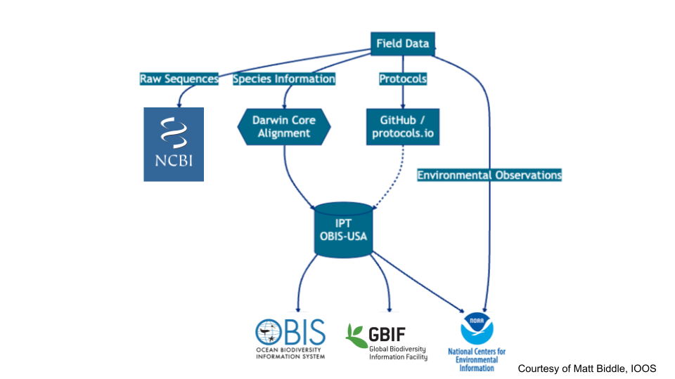

Getting Started
=====

## Key Requirements for Omics Data 

In accordance with the NOAA plan to increase [Public Access to Research Results (PARR)](https://www.glerl.noaa.gov/review2016/reviewer_docs/NOAA_PARR_Plan_v5.04.pdf), NOAA-funded digitally formatted scientific data must be made publicly visible and accessible in a timely manner, in a machine-readable format using non-proprietary standards, and with the metadata necessary to find and properly use the data.  

To meet these requirements, every NOAA Omics project should have a Data Management Plan. At **minimum** a data management plan should include:  
1. Submission of [omics data](https://github.com/aomlomics/omics-data-management/wiki/5-Omics-Data-Guidelines#table-1---data-repositories) to the appropriate public data repository (e.g., sequence data to NCBI).
2. Projects including [environmental measurements](https://github.com/aomlomics/omics-data-management/wiki/4-Metadata-Guidelines#ncei) (e.g., cruises, mesocosm experiments) must submit metadata and environmental data to [NCEI](https://www.ncei.noaa.gov/). For all projects, relevant metadata and data products not submitted in (#1) should be submitted to the appropriate public archived repository.
3. Persistent digital object identifiers (DOI) or accession numbers generated in (#1) and (#2) must be [cross-linked](https://github.com/aomlomics/omics-data-management/wiki/5-Omics-Data-Guidelines#archiving-and-cross-linking) so that all data and metadata from a project can be discoverable.  
4. Fill out a [Data Management Plan template](https://github.com/aomlomics/omics-data-management/wiki/2-Data-Management-Plan-Template).

## Data Management Workflow

A successful data management workflow will contain the following steps:

* **Start early** – Develop your [data management plan](https://github.com/aomlomics/omics-data-management/wiki/2-Data-Management-Plan-Template) (with help from this guide) at the proposal stage.
* **Identify your data type(s)** – The types of omics data you generate (e.g., amplicon, metagenomic, proteomic) dictate [which standards are available](https://github.com/aomlomics/omics-data-management/wiki/5-Omics-Data-Guidelines) and some of the metadata you'll want to collect (e.g., the sample preparation data).
* **Identify your environment(s)** – If your samples came from the environment (e.g., seawater) or an environmental system (mesocosm), there are specific parameters you'll want to collect (e.g., temperature, salinity). If your samples are from an experimental system, you'll want to capture your experimental factors and possibly also ambient conditions.
* **Locate checklists and templates** – Find the relevant [standards, checklists and templates](https://github.com/aomlomics/omics-data-management/wiki/3-Study-Data-Templates) for your data type(s) and environment(s). 
* **Complete your metadata** – As soon as you have sample or experimental metadata, start recording it in the appropriate format. Make sure to backup original and formatted metadata files.
* **Identify (meta)data repositories** – List the relevant and required data and metadata repositories, then verify submission instructions and user accounts.
* **Submit your data!** – Recommended timeline for submission is one year after the project end date (NOAA intramural PIs), two years after the project end (extramural PIs), or before a paper is published using these data (whichever is sooner). 

